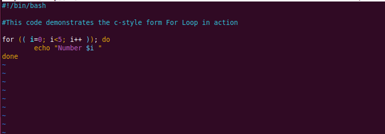

# control_flow_project
This project demonstrated know of control flows in linux

# Control Flow in Shell Scripting

## Overview
This project explores **control flow statements** in Shell scripting, focusing on decision-making and loops. The core concepts include:
- `if-else` statements
- `for` loops
- `while` loops
- `case` statements

## Key Learnings
1. **Control Flow Concepts**  
   - Understanding how scripts execute different paths based on conditions.
   - Practicing logic-driven scripting.

2. **Conditional Statements (`if-else`)**  
   - Implemented a script (`control_flow.sh`) that determines whether a number is **positive, negative, or zero**.
   - Used:
     - `if`, `elif`, `else`, `then`, and `fi`.

3. **Looping Mechanisms (`for` loops)**  
   - Explored common use cases like **batch processing, data analysis, and automated testing**.
   - Learned two main forms of `for` loops:
     - **List form**
     - **C-style form**
   - Created scripts for both loop types, set correct permissions, and executed them successfully.

## Execution
Ensured scripts have executable permissions before

    running:    
    chmod u+x script_name.sh
    ./script_name.sh

This project provided hands-on experience with core Shell scripting control flow, reinforcing structured programming principles, and the practice activities were carried out according to the instructors instruction.

## Screenshots

Screenshots serving as proof of indicated activities are included below:

